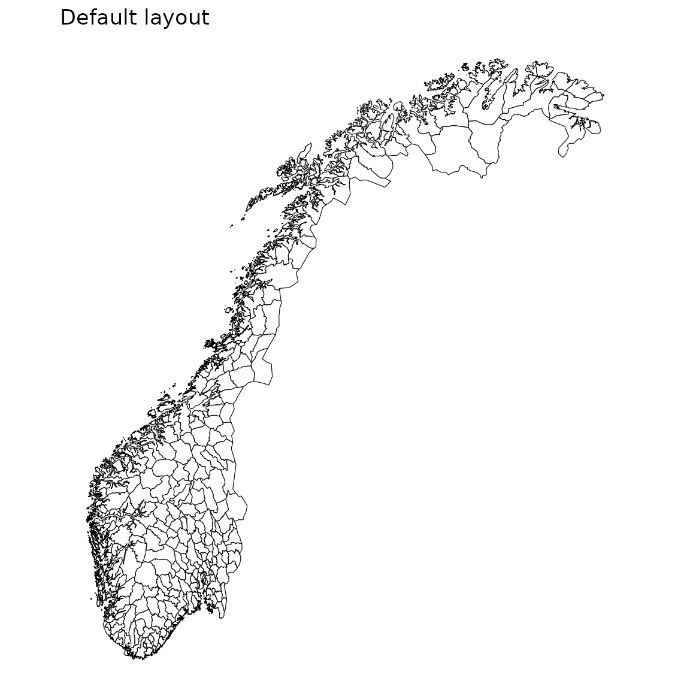

# Introduction

`csmaps` is a package for map visualisation developed by members of
[Core Surveillance](https://niphr.github.io). The package contains map
data for Norway at different levels geographic granularity and layout.

``` r
library(csmaps)
#> csmaps 2025.8.21
#> https://niphr.github.io/csmaps/
library(ggplot2)
library(data.table)
#> 
#> Attaching package: 'data.table'
#> The following object is masked from 'package:base':
#> 
#>     %notin%
library(magrittr)
```

A map with the default layout can be made in this way. For more advanced
*layout* and *customization*, see the relevant documentation vignettes.

``` r
pd <- copy(csmaps::nor_municip_map_b2024_default_dt)
q <- ggplot()
q <- q + geom_polygon(
  data = pd,
  aes( 
    x = long,
    y = lat,
    group = group
  ), 
  color="black", 
  fill="white",
  linewidth = 0.2
)
q <- q + theme_void()
q <- q + coord_quickmap()
q <- q + labs(title = "Default layout")
q
```



``` r
pd <- copy(csmaps::nor_county_map_b2024_default_dt)
q <- ggplot()
q <- q + geom_polygon(
  data = pd,
  aes( 
    x = long,
    y = lat,
    group = group
  ), 
  color="black", 
  fill="white",
  linewidth = 0.4
)
q <- q + theme_void()
q <- q + coord_quickmap()
q <- q + labs(title = "Default layout")
q
```


