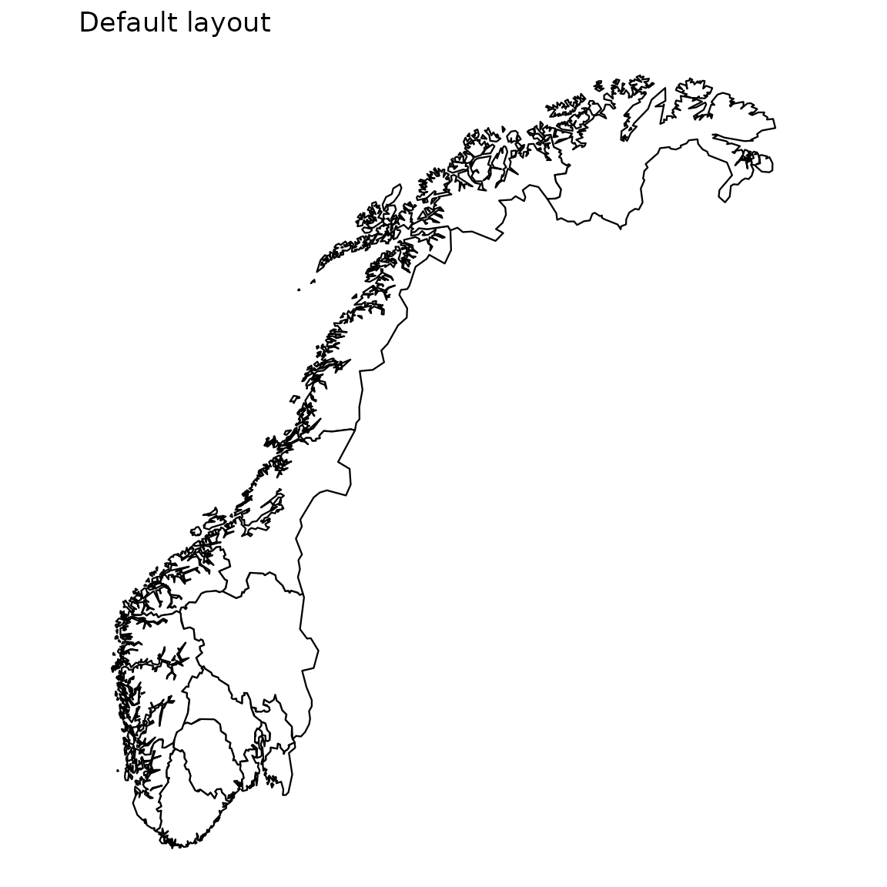

# Introduction

`csmaps` ships the geometry of Norway as plain `data.table` objects, so
you can draw choropleth maps with ggplot2 alone, without `sf`, GDAL, or
any other geo-library. It is part of the [Core
Surveillance](https://niphr.github.io) family of R packages, and covers
counties, municipalities, and Oslo’s city wards across four
redistricting years (2017, 2019, 2020, and 2024).

## Setup

Load csmaps alongside ggplot2 and data.table:

``` r
library(csmaps)
#> csmaps 2025.8.21
#> https://niphr.github.io/csmaps/
library(ggplot2)
library(data.table)
#> 
#> Attaching package: 'data.table'
#> The following object is masked from 'package:base':
#> 
#>     %notin%
library(magrittr)
```

## A first map

Every map is a `data.table` of polygon coordinates, so you can hand it
straight to
[`geom_polygon()`](https://ggplot2.tidyverse.org/reference/geom_polygon.html).
Here is the municipality map for the 2024 borders:

``` r
pd <- copy(csmaps::nor_municip_map_b2024_default_dt)
q <- ggplot()
q <- q + geom_polygon(
  data = pd,
  aes(
    x = long,
    y = lat,
    group = group
  ),
  color="black",
  fill="white",
  linewidth = 0.2
)
q <- q + theme_void()
q <- q + coord_quickmap()
q <- q + labs(title = "Default layout")
q
```


The same code draws the counties; only the dataset changes:

``` r
pd <- copy(csmaps::nor_county_map_b2024_default_dt)
q <- ggplot()
q <- q + geom_polygon(
  data = pd,
  aes(
    x = long,
    y = lat,
    group = group
  ),
  color="black",
  fill="white",
  linewidth = 0.4
)
q <- q + theme_void()
q <- q + coord_quickmap()
q <- q + labs(title = "Default layout")
q
```



## Where to next

For a split north/south view or an inset that enlarges Oslo, see the
*layout* vignette. To shade regions by your own numbers, see
*customization*. The full list of datasets lives in the
[reference](https://niphr.github.io/csmaps/reference/index.md).
