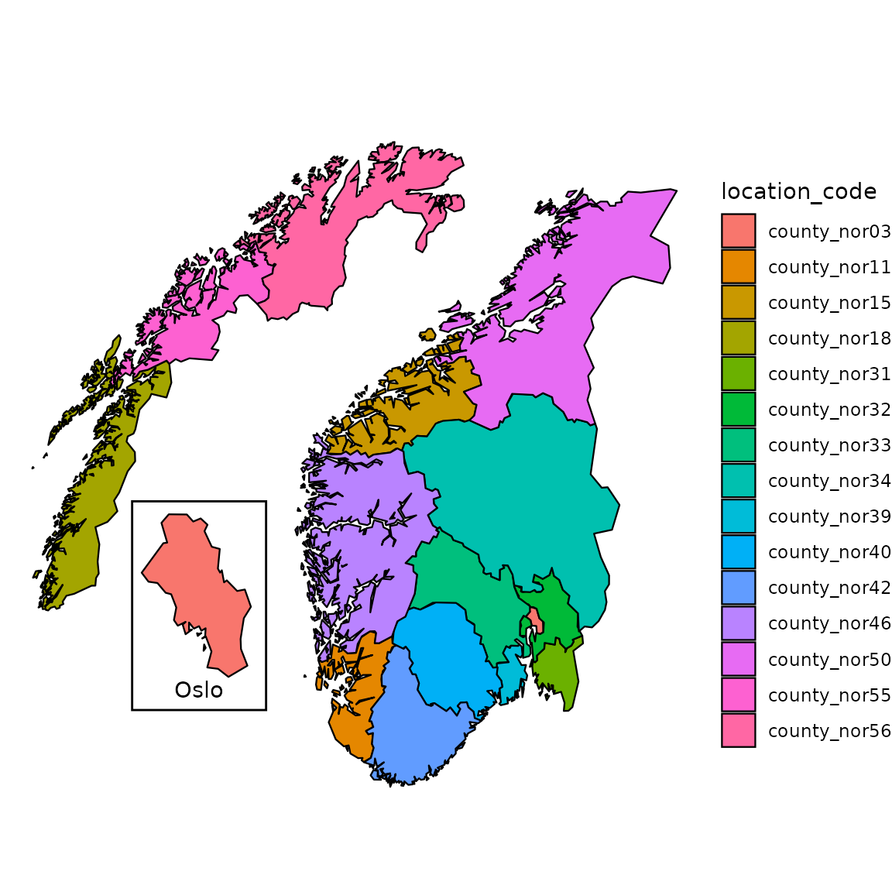
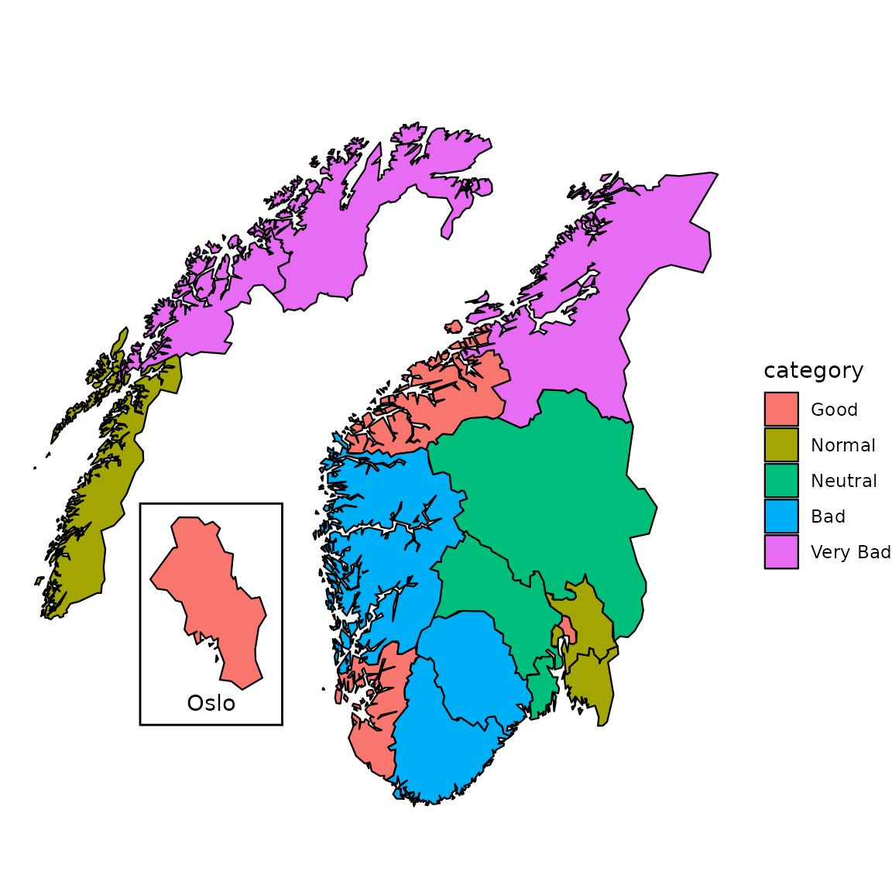
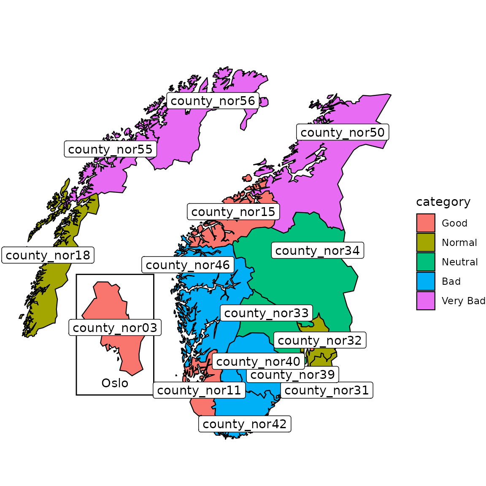
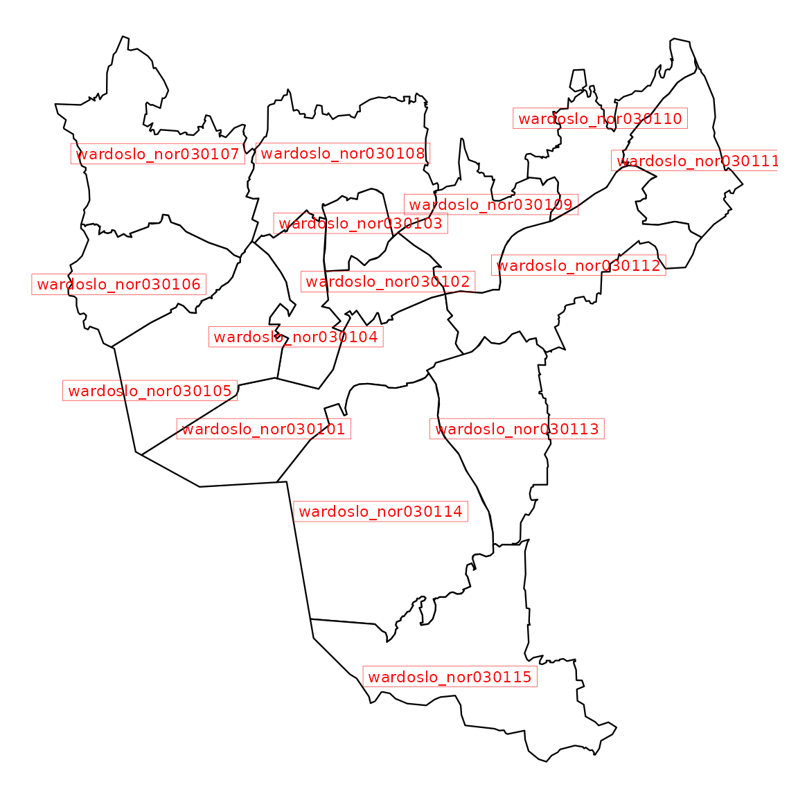
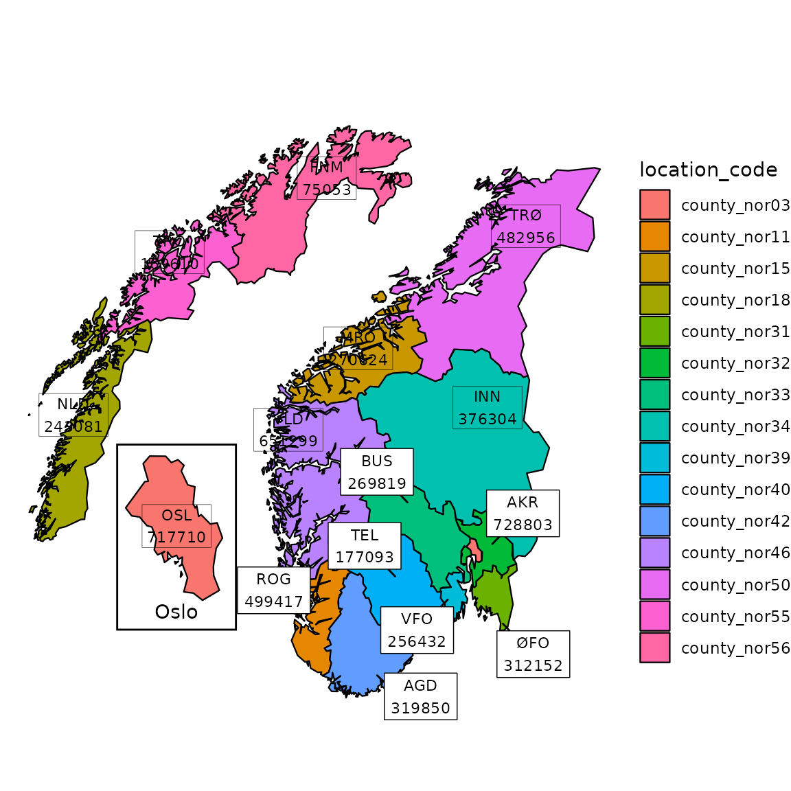
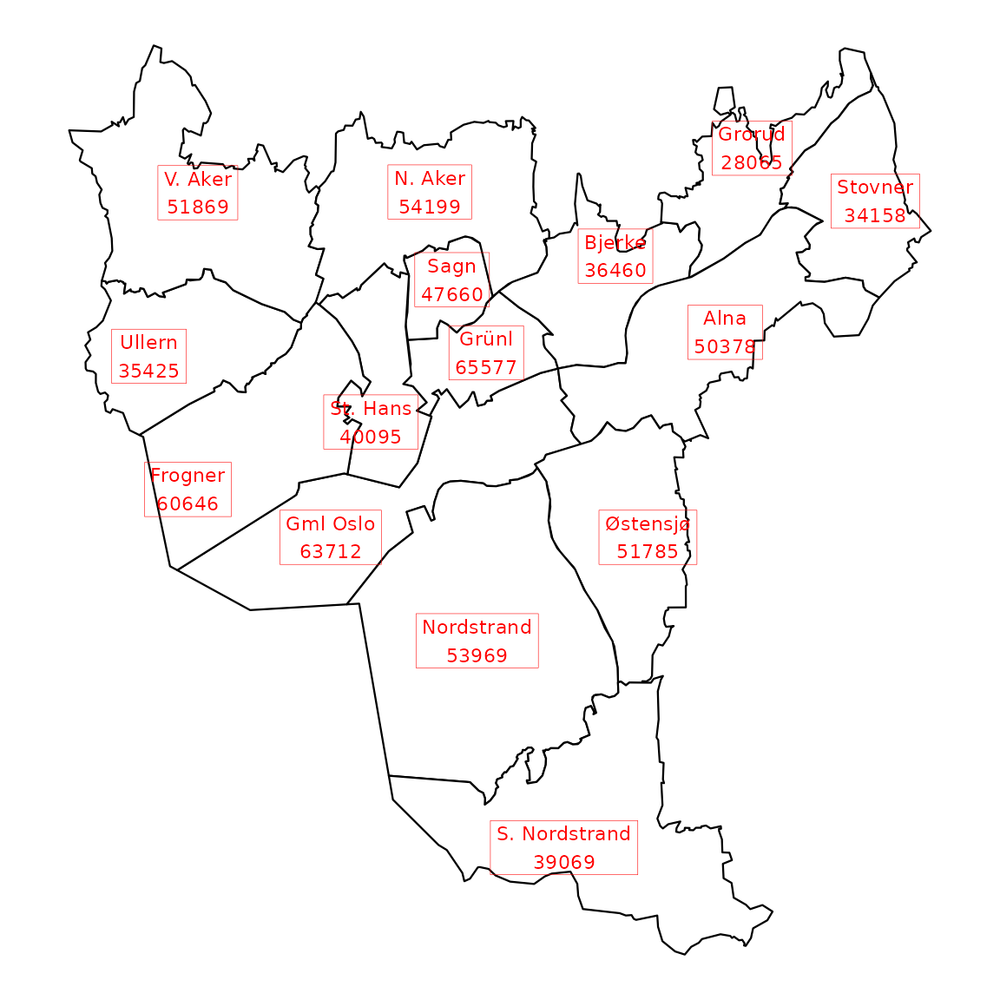

# Customize your maps

``` r
library(csmaps)
#> csmaps 2025.8.21
#> https://niphr.github.io/csmaps/
library(ggplot2)
library(data.table)
#> 
#> Attaching package: 'data.table'
#> The following object is masked from 'package:base':
#> 
#>     %notin%
library(magrittr)
```

## Colored maps

### Automatic coloring by `location_code`

``` r
pd <- copy(csmaps::nor_county_map_b2024_split_dt)

q <- ggplot()
q <- q + csmaps::annotate_oslo_nor_map_bxxxx_split_dt()
q <- q + geom_polygon(
  data = pd, 
  mapping = aes(
    x = long, 
    y = lat,
    group = group,
    fill = location_code
  ),  
  color="black",
  linewidth = 0.4
)
q <- q + theme_void()
q <- q + coord_quickmap()
q <- q + labs(title = "")
q
```



### Customized coloring with external information

It is also possible to specify the color by user-defined groups. Here we
show an example of assigning different (pseudo) risk level to each
county.

``` r
pd <- copy(csmaps::nor_county_map_b2024_split_dt)

# assign each location a random category for different colors
location_info <- unique(pd[,c("location_code")])
location_info[,category:=rep(
  c("Good","Normal","Neutral","Bad","Very Bad"),
  each=3)[1:.N]
]
location_info[,category:=factor(
  category,
  levels=c("Good","Normal","Neutral","Bad","Very Bad")
  )
]
print(location_info)
#>     location_code category
#>            <char>   <fctr>
#>  1:  county_nor03     Good
#>  2:  county_nor11     Good
#>  3:  county_nor15     Good
#>  4:  county_nor18   Normal
#>  5:  county_nor31   Normal
#>  6:  county_nor32   Normal
#>  7:  county_nor33  Neutral
#>  8:  county_nor34  Neutral
#>  9:  county_nor39  Neutral
#> 10:  county_nor40      Bad
#> 11:  county_nor42      Bad
#> 12:  county_nor46      Bad
#> 13:  county_nor50 Very Bad
#> 14:  county_nor55 Very Bad
#> 15:  county_nor56 Very Bad

# join the map data.table
pd[
  location_info,
  on="location_code",
  category:=category
]

q <- ggplot()
q <- q + csmaps::annotate_oslo_nor_map_bxxxx_split_dt()
q <- q + geom_polygon(
  data = pd, 
  mapping = aes(
    x = long, 
    y = lat,
    group = group,
    fill = category
  ),  
  color="black",
  linewidth = 0.4
)
q <- q + coord_quickmap()
q <- q + labs(title="")
q <- q + theme_void()
q
```



## Labeled maps

We can add labels of county index onto the maps. There are several
options for adding texts on a graph in `ggplot2`. We recommend
[`geom_label()`](https://ggplot2.tidyverse.org/reference/geom_text.html)
to add the labels if no label overlap occurs, otherwise we recommend
using
[`ggrepel::geom_label_repel()`](https://ggrepel.slowkow.com/reference/geom_text_repel.html).

``` r
q <- ggplot()
q <- q + csmaps::annotate_oslo_nor_map_bxxxx_split_dt()
q <- q + geom_polygon(
  data = pd, 
  mapping = aes(
    x = long, 
    y = lat,
    group = group,
    fill = category
  ),  
  color="black",
  linewidth = 0.4
)
q <- q + geom_label(
  data = csmaps::nor_county_position_geolabels_b2024_split_dt,
  mapping = aes(
    x = long, 
    y = lat,
    label = location_code
  )
)
# ggrepel::geom_label_repel() for avoiding overlap
q <- q + theme_void()
q <- q + coord_quickmap()
q <- q + labs(title = "")
q
```



Labels can be easily added to other layouts, such as Oslo wards.

``` r
q <- ggplot(mapping = aes(x = long, y = lat))
q <- q + geom_polygon(
  data = csmaps::oslo_ward_map_b2024_default_dt,
  mapping = aes(group = group),
  color = "black",
  fill = "white",
  linewidth = 0.4
)
q <- q + geom_label(
  data = csmaps::oslo_ward_position_geolabels_b2024_default_dt,
  mapping = aes(label = location_code),
  color = "red",
  size = 3,
  label.size = 0.1,
  label.r = grid::unit(0, "lines")
)
#> Warning: The `label.size` argument of `geom_label()` is deprecated as of ggplot2 3.5.0.
#> ℹ Please use the `linewidth` argument instead.
#> This warning is displayed once per session.
#> Call `lifecycle::last_lifecycle_warnings()` to see where this warning was
#> generated.
q <- q + theme_void()
q <- q + coord_quickmap()
q
```



## Enrich plot with additional data

It is convenient to use `csdata` package to enrich Norway and Oslo maps
with external information, such as location name and population.

### Add county name and population to Norway map

``` r
# enrich with population and location name
dpop_2024 <- csdata::nor_population_by_age_cats()[
  calyear==2024 &
  granularity_geo %in% "county"
]

# join, create label
labels <- copy(csmaps::nor_county_position_geolabels_b2024_split_dt)
labels[
  dpop_2024, 
  on = "location_code",
  pop_total := pop_jan1_n
]
labels[
  csdata::nor_locations_names(), 
  on = "location_code",
  location_name_short := location_name_short
]
labels[, label := paste0(location_name_short, '\n', pop_total)]
print(head(labels))
#>    location_code  long      lat  repel pop_total location_name_short
#>           <char> <num>    <num> <lgcl>     <num>              <char>
#> 1:  county_nor31 11.50 59.00000   TRUE    312152                 ØFO
#> 2:  county_nor32 11.20 60.03851   TRUE    728803                 AKR
#> 3:  county_nor33  8.85 60.60000   TRUE    269819                 BUS
#> 4:  county_nor03  2.20 60.30000  FALSE    717710                 OSL
#> 5:  county_nor34 11.10 61.90000  FALSE    376304                 INN
#> 6:  county_nor39 10.00 59.32481   TRUE    256432                 VFO
#>          label
#>         <char>
#> 1: ØFO\n312152
#> 2: AKR\n728803
#> 3: BUS\n269819
#> 4: OSL\n717710
#> 5: INN\n376304
#> 6: VFO\n256432

# plot
pd <- copy(csmaps::nor_county_map_b2024_split_dt)

q <- ggplot()
q <- q + csmaps::annotate_oslo_nor_map_bxxxx_split_dt()
q <- q + geom_polygon(
  data = pd, 
  mapping = aes(
    x = long,
    y = lat,
    group = group,
    fill = location_code
  ),
  color="black",
  linewidth = 0.4
)
q <- q + ggrepel::geom_label_repel(
  data = labels[repel==TRUE],
  mapping = aes(x = long, y = lat, label = label),
  size = 3,
  label.size = 0.1,
  label.r = grid::unit(0, "lines"),
  min.segment.length = 0
)
q <- q + geom_label(
  data = labels[repel==FALSE],
  mapping = aes(x = long, y = lat, label = label),
  size = 3,
  label.size = 0.1,
  label.r = grid::unit(0, "lines")
)
q <- q + theme_void()
q <- q + coord_quickmap()
q <- q + labs(title = "")
q
```



### Add location name for ward and population for Oslo map

``` r
# enrich with population and location name
dpop_2024 <- csdata::nor_population_by_age_cats()[calyear==2024]

# join, create label
labels <- copy(csmaps::oslo_ward_position_geolabels_b2024_default_dt)
labels[
  dpop_2024, 
  on = "location_code",
  pop_total := pop_jan1_n
]
labels[
  csdata::nor_locations_names(), 
  on = "location_code",
  location_name_short := location_name_short
]
labels[, label := paste0(location_name_short, '\n', pop_total)]
print(head(labels))
#>         location_code     long      lat pop_total location_name_short
#>                <char>    <num>    <num>     <num>              <char>
#> 1: wardoslo_nor030101 10.72000 59.89000     63712            Gml Oslo
#> 2: wardoslo_nor030102 10.78000 59.92567     65577               Grünl
#> 3: wardoslo_nor030103 10.76683 59.93981     47660                Sagn
#> 4: wardoslo_nor030104 10.73555 59.91230     40095            St. Hans
#> 5: wardoslo_nor030105 10.66500 59.89925     60646             Frogner
#> 6: wardoslo_nor030106 10.65000 59.92500     35425              Ullern
#>              label
#>             <char>
#> 1: Gml Oslo\n63712
#> 2:    Grünl\n65577
#> 3:     Sagn\n47660
#> 4: St. Hans\n40095
#> 5:  Frogner\n60646
#> 6:   Ullern\n35425

q <- ggplot(mapping = aes(x = long, y = lat))
q <- q + geom_polygon(
  data = csmaps::oslo_ward_map_b2024_default_dt,
  mapping = aes(group = group),
  color = "black",
  fill = "white",
  linewidth = 0.4
)
q <- q + geom_label(
  data = labels,
  mapping = aes(label = label),
  color = "red",
  size = 3,
  label.size = 0.1,
  label.r = grid::unit(0, "lines")
)
q <- q + theme_void()
q <- q + coord_quickmap()
q
```


