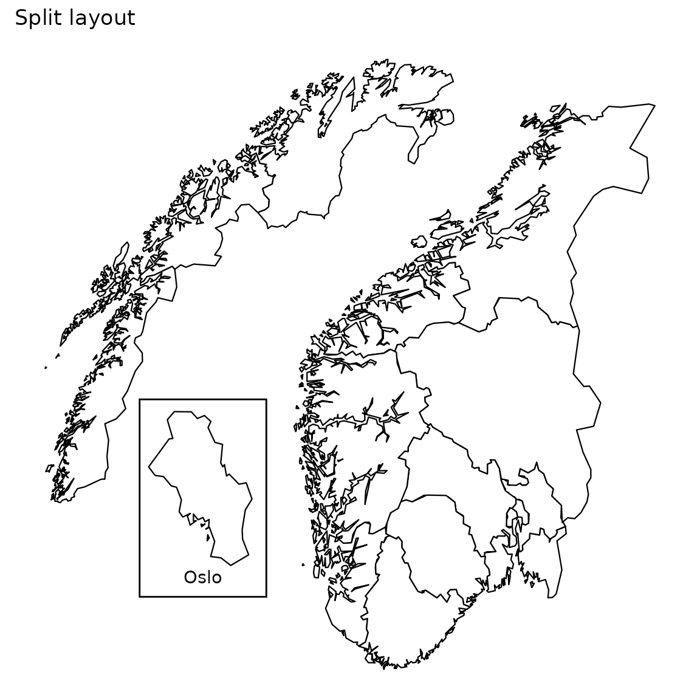
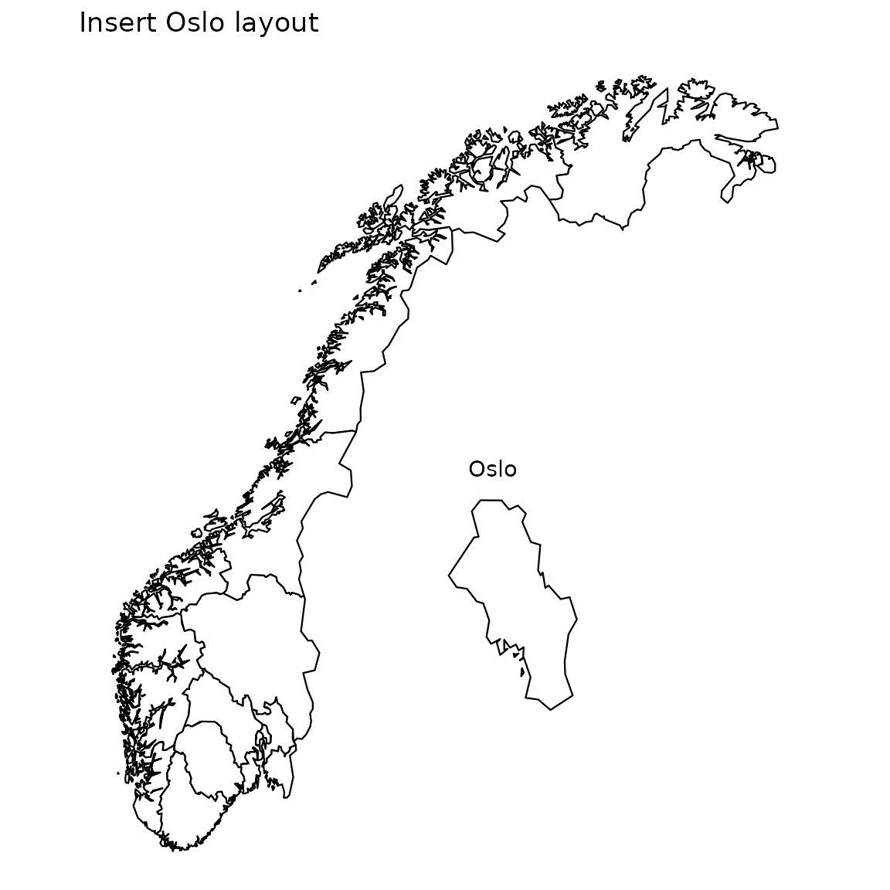
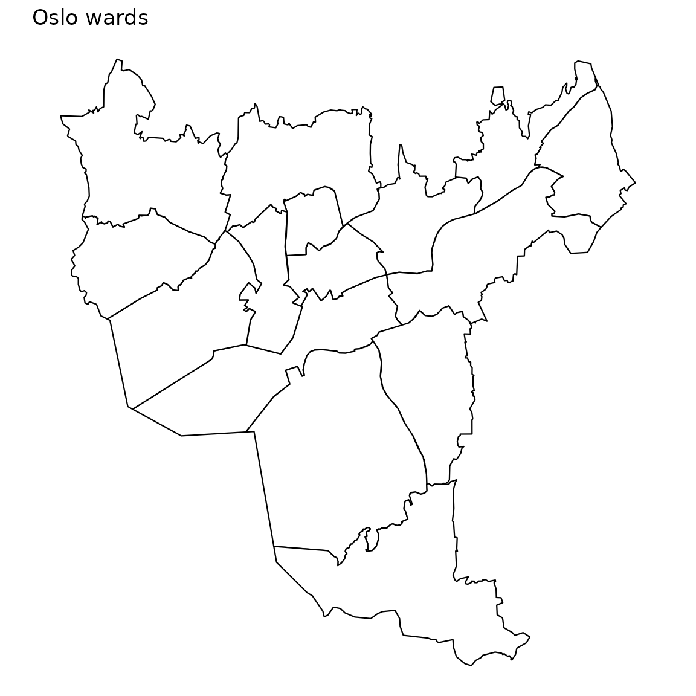

# Layout

Every csmaps dataset name follows one consistent pattern, and each
Norway map comes in a few layouts. This vignette explains the naming
scheme and then shows what each layout looks like.

``` r
library(csmaps)
#> csmaps 2025.8.21
#> https://niphr.github.io/csmaps/
library(ggplot2)
library(data.table)
#> 
#> Attaching package: 'data.table'
#> The following object is masked from 'package:base':
#> 
#>     %notin%
library(magrittr)
```

## Naming scheme

The naming scheme has the following pattern:
`scope_geogranularity_type_border_layout_Rclass`.

### Scope

This is what content the map data contains. Currently we focus on these
2 scopes:

- Country (Norway).
- City (Oslo).

### Geogranularity

This is the geographic granularity, which defines the border of county,
municipality and ward.

- County (fylke) is equivalent to NUTS3 (Nomenclature of Territorial
  Unit level 3).
- Municip (kommune) is equivalent to LAU2 (Local Administrative Unit
  level 2).
- Ward (bydel) is an administrative region within a large municipality.
- xxx: only used for plotting `position_title` (see
  [example](#norway-layout-insert-oslo)).

### Type

The type of the data object to distinguish whether it’s a geographical
map or coordinate for label positions. - Map: Map data. - Position
geolabels: Geographical coordinates for the position of labels,
e.g. “county03” or “Oslo”. - Position title (insert oslo): Geographical
coordinate for position of title. So far it’s only for layout:
`insert_oslo`. (see [example](#norway-layout-insert-oslo))

### Border

Due to recent redistricting, there exist multiple versions of
county/municip borders. We provide maps that match the borders in the
following years:

- 2024: The current border, this map contains 15 counties.
- 2020: Border before redistricting in 2024. This map contains 11
  counties.
- 2019: Border before redistricting in 2020. This map contains 18
  counties.
- 2017: Border before redistricting in 2018. This map contains 19
  counties.

More information on counties in Norway can be found
[here](https://en.wikipedia.org/wiki/Counties_of_Norway#cite_note-13).

### Layout

See the [layout](#layout) section below.

### R class

R class for the map object.

- `data.table`: applicable for maps and label/title coordinates.
- `sf`: simple feature for spatial vector data. More on
  [sf](https://r-spatial.github.io/sf/articles/).

## Layout

We have 3 layout options for Norway map: **default, split** and **insert
Oslo**.

For the Oslo map, we only have the **default** layout.

### Norway: default

``` r
pd <- copy(csmaps::nor_county_map_b2024_default_dt)
q <- ggplot()
q <- q + geom_polygon(
  data = pd, 
  aes( 
    x = long, 
    y = lat, 
    group = group
  ), 
  color="black", 
  fill="white",
  linewidth = 0.4
)
q <- q + theme_void()
q <- q + coord_quickmap()
q <- q + labs(title = "Default layout")
q
```


### Norway: split

``` r
pd <- copy(csmaps::nor_county_map_b2024_split_dt)
q <- ggplot()
q <- q + csmaps::annotate_oslo_nor_map_bxxxx_split_dt()
q <- q + geom_polygon(
  data = pd, 
  aes(
    x = long, 
    y = lat, 
    group = group
  ), 
  color="black", 
  fill="white",
  linewidth = 0.4
)
q <- q + theme_void()
q <- q + coord_quickmap()
q <- q + labs(title = "Split layout")
q
```



### Norway: insert oslo

``` r
pd <- copy(csmaps::nor_county_map_b2024_insert_oslo_dt)
q <- ggplot()
q <- q + geom_polygon(
  data = pd,
  aes(
    x = long, 
    y = lat, 
    group = group
  ), 
  color="black", 
  fill="white", 
  linewidth = 0.4
)
q <- q + annotate(
  "text", 
  x = csmaps::nor_xxx_position_title_insert_oslo_b2024_insert_oslo_dt$long, 
  y = csmaps::nor_xxx_position_title_insert_oslo_b2024_insert_oslo_dt$lat,
  label = "Oslo"
  )
q <- q + theme_void()
q <- q + coord_quickmap()
q <- q + labs(title = "Insert Oslo layout")
q
```



#### Oslo ward: default

``` r
pd <- copy(csmaps::oslo_ward_map_b2024_default_dt)
q <- ggplot()
q <- q + geom_polygon(
  data = pd,
  aes(
    x = long, 
    y = lat, 
    group = group
  ), 
  color="black", 
  fill="white",
  linewidth = 0.4
)
q <- q + theme_void()
q <- q + coord_quickmap()
q <- q + labs(title = "Oslo wards")
q
```


