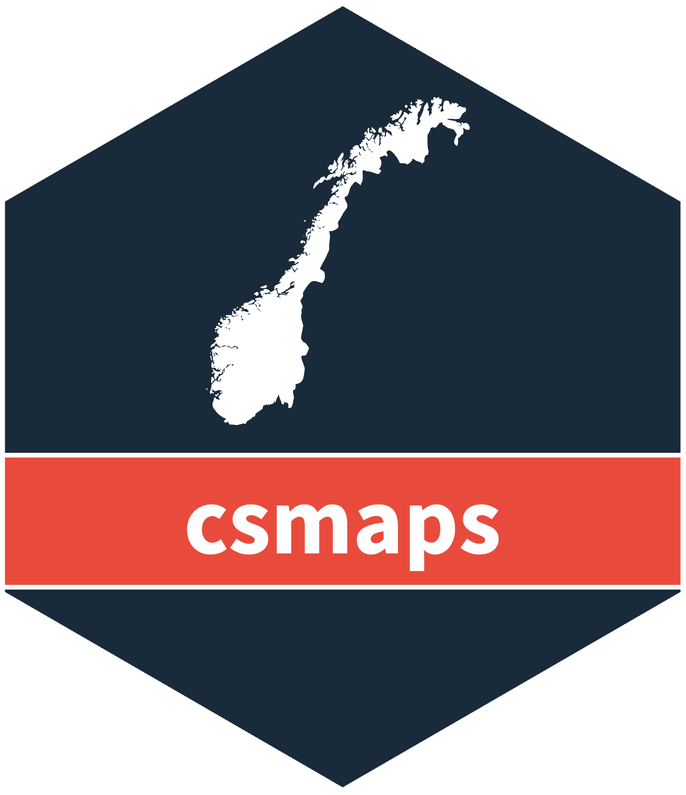
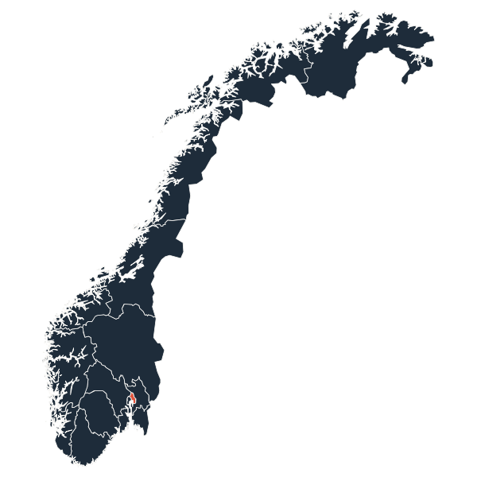
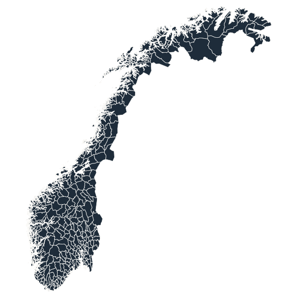
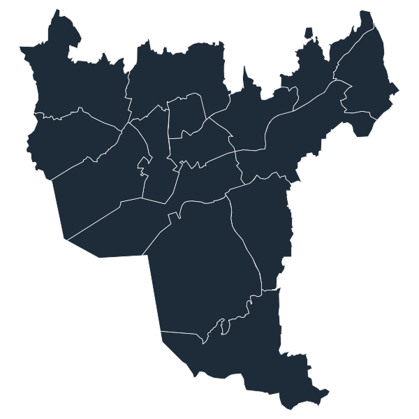

R package · Maps of Norway

<h1>Preformatted maps of Norway.</h1>

Choropleth-ready maps at county, municipality and Oslo-ward level — <em>no geolibraries required.</em> Built for public-health reporting across Norway's geographic levels.

<a class="cs-btn" href="articles/csmaps.html">Get started</a> <a class="cs-btn-link" href="reference/index.html">Browse the reference →</a>

Geographic granularities

01
<h3>County</h3>
All Norwegian counties, in multiple layouts and coordinate systems.

02
<h3>Municipality</h3>
Full municipal maps for the 2024, 2020, 2019 &amp; 2017 redistricting.

03
<h3>City ward</h3>
Detailed Oslo <em>bydeler</em> for fine-grained urban reporting.

Map gallery

<figure>

<figcaption>County · b2024 default</figcaption></figure>
<figure>

<figcaption>Municipality · b2024</figcaption></figure>
<figure>

<figcaption>Oslo wards · b2024</figcaption></figure>

## Overview

csmaps provides preformatted maps of Norway that generally do not need
geolibraries, for public-health reporting at county, municipality, and Oslo-ward
level. It is convenient to visualise maps with additional information, either
using text labels or colour palettes.

Read the introduction vignette [here](articles/csmaps.html) or run
`help(package = "csmaps")`.
